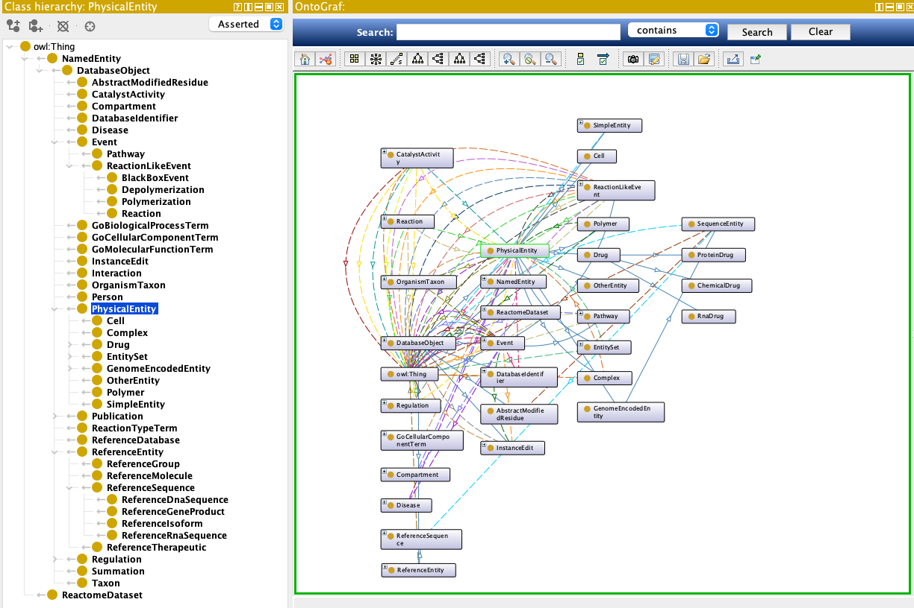

# Ontology Artifacts

This project publishes ontology-oriented artifacts generated from the LinkML schema.

The primary schema source remains:

`src/reactome_ontology/schema/reactome_ontology.yaml`

From that source, the project generates ontology distribution files that can be used for browsing, reuse, and downstream validation.

## Published TTL Files

- [OWL ontology (Turtle)](schema/reactome_ontology.owl.ttl)
- [SHACL shapes (Turtle)](schema/reactome_ontology.shacl.ttl)

These files are published with the documentation under `docs/schema/` and are copied there from the tracked artifacts in the `ontology/` folder during `just gen-doc`.

## Protégé View

The following screenshot shows the ontology opened in Protégé. The left panel shows the class hierarchy, while the right panel shows an OntoGraf visualization of the ontology structure.

## Notes

- The LinkML schema is the source of truth.
- The OWL and SHACL files are generated artifacts derived from that schema.
- When the schema changes, regenerate the ontology outputs before publishing updates.
